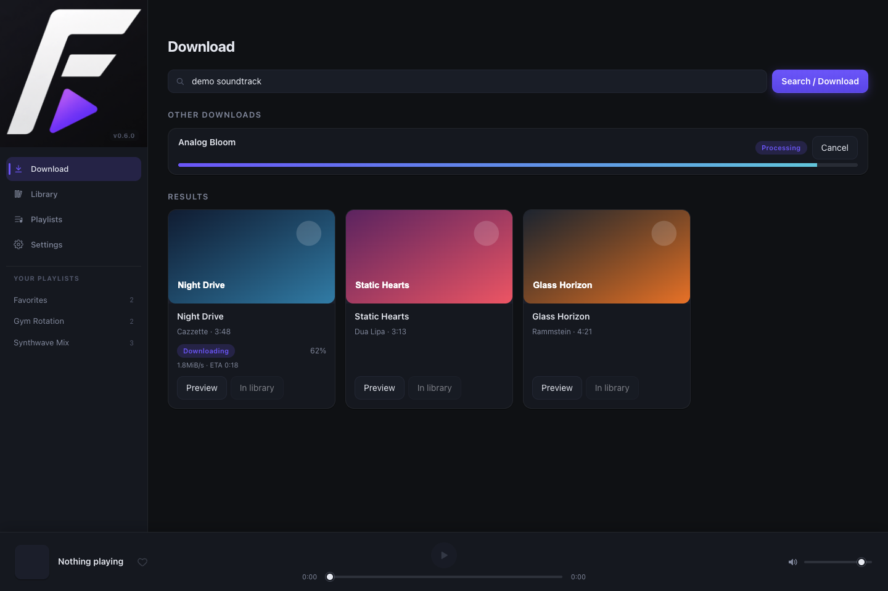
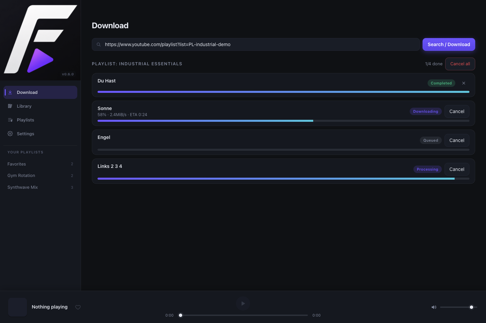
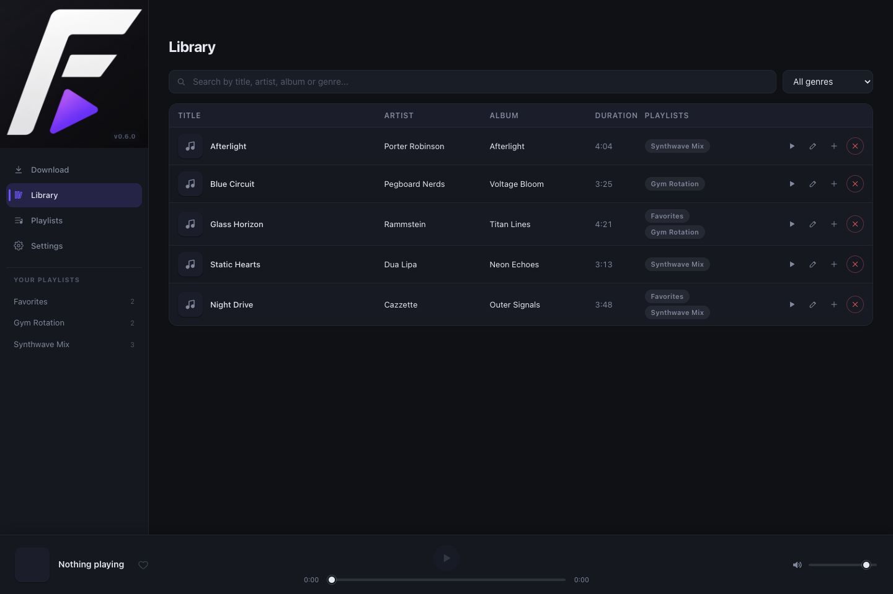
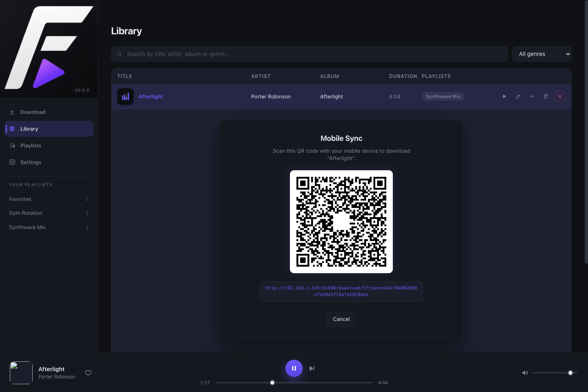
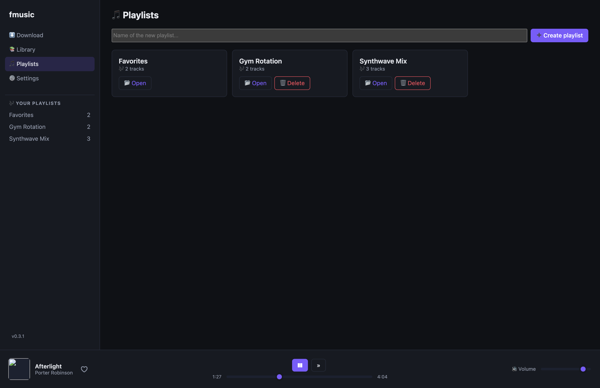
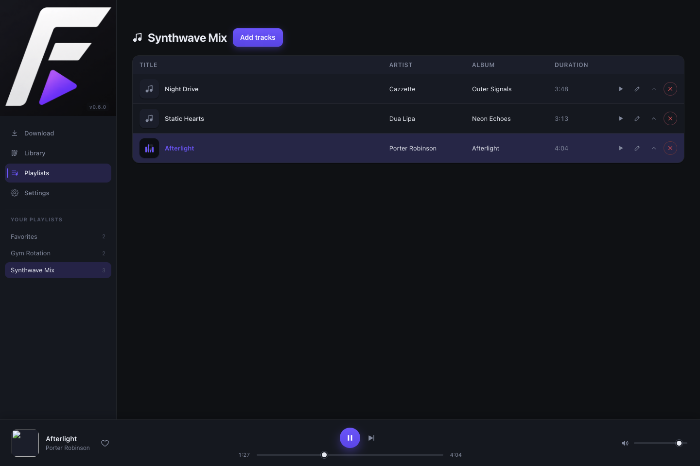
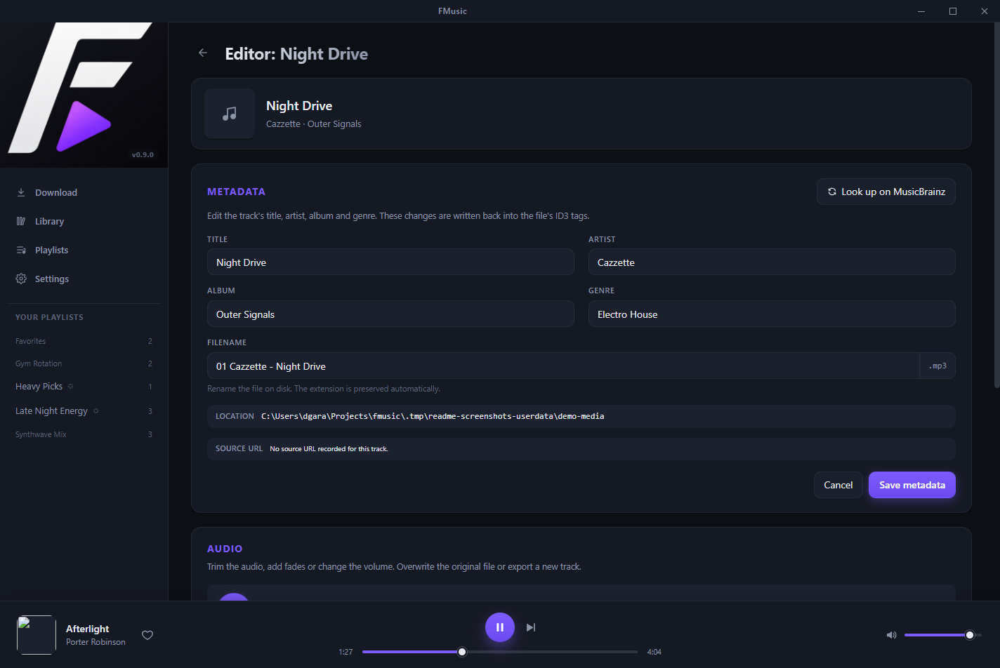
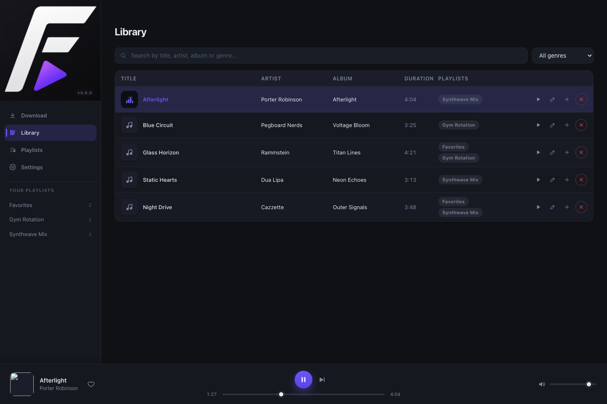
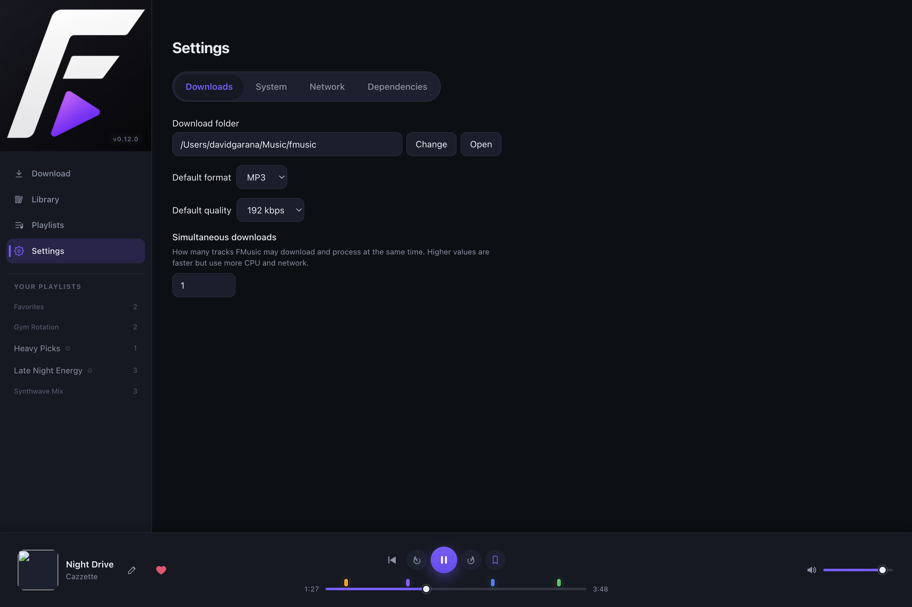

<p align="center">
  
</p>

# FMusic

Cross-platform desktop app (Windows, macOS and Linux) to **download music
from YouTube**, **manage a local library** (playlists, genres…) and
**listen to it** without leaving the app.

Built with **Electron + Vite + React + TypeScript** and powered by the
standalone **yt-dlp** and **FFmpeg** binaries — no Python installation
required on the user's machine.

## Features

### Search and download
- 🔎 **Search** YouTube for songs by name, with **pagination** (12 at a time via "Load more") and inline audio preview before downloading.
- ⬇️ **Download** audio from a YouTube URL (MP3 / M4A / Opus, configurable quality) with a download queue, live progress and a button to dismiss finished notifications.
- 🎼 **Playlist imports** create a matching local playlist and group the queued downloads together.
- 🔁 **Resume** cancelled downloads: clicking the button again on a cancelled download re-queues it.
- ℹ️ **Notice** when trying to download a URL that is already in your library.
- 📋 The "Other downloads" section appears above the search results for better visibility.





### Library and playlists
- 📚 **Library** stored in SQLite with sortable table, search, and genre filter.
- ✏️ **Editable metadata**: title, artist, album and genre can be edited directly from the Library table.
- 💡 **Autocomplete while editing**: artist, album and genre fields suggest values already present in your library.
- 🔄 **Online metadata sync**: each track can query **MusicBrainz** from the Library table to suggest title, artist, album and genre.
- 🧠 **Smart metadata matching**: the lookup tries title + artist + album first, then progressively broader searches, and falls back across recording / release / release-group / artist genres.
- 💾 **Metadata persistence**: manual edits are saved to the app database and also written back to the audio file for **MP3** tracks (ID3 tags).
- 📝 **Playlists** with add / remove / reorder tracks.
- ♥ **Favorites**: protected special playlist (cannot be deleted); heart button in the player toggles the current track in Favorites instantly.
- 📱 **Mobile Sync**: download specific tracks to your mobile device by scanning a dynamically generated QR code.
- 🔄 **Real-time refresh**: opening a playlist and adding tracks from elsewhere in the app updates the view without a reload.









### Edit Audio
- ✂️ **Workbench**: professional-grade audio manipulation workspace for every track.
- 📏 **Trimming**: dual-handle visual slider to cut silence or unwanted parts from the start/end.
- ✨ **Effects**: add **Fade-in** and **Fade-out** (0-10s) for smoother transitions.
- 🔊 **Volume adjustment**: normalize or boost audio volume (0% to 200%).
- 💾 **Export modes**: choose between **overwriting** the original track or **exporting as a new track** in your library.
- 🎧 **Built-in preview**: listen to the track and see the playback position on the trim bar while editing.



### Player
- 🎧 Integrated **playback** with queue, progress bar with **working seek** (dragging the bar jumps to the exact position without restarting the track), transport controls and volume (Howler.js).
- ⏮⏭ Previous / next buttons are hidden when there is no adjacent track, without shifting the play button.
- 🎵 Rich local metadata: cover art, artist, album, genre, year.

### Sonos
- 📡 **Streaming to Sonos**: discover Sonos devices on the local network and cast the current track to any of them with a click.
- 🔊 **play / pause / next / previous / volume / seek** controls are routed to Sonos when active.
- ■ Per-device **stop** button that doesn't affect the other devices.
- 🌐 Internal HTTP server with **Range request** support so Sonos can seek inside the track without downloading it fully.
- 💾 **Cached devices**: discovered Sonos devices are remembered across sessions and auto-reconnected when the panel opens; unreachable ones are automatically removed from the cache.
- 🔌 **Add by IP**: connect to a Sonos device by typing its IP manually, useful when a VPN blocks SSDP multicast discovery.
- 🔇 Starting to cast pauses the local player so both outputs don't play at once.



### System tray and mini player
- 🖥️ **The app stays in the background** when the main window is closed (system tray icon; the process is not actually killed).
- 🎛️ **Floating mini player** (340 × 96 px, always-on-top): opens on tray icon click.
  - Shows cover art, title, artist and basic controls (previous / play·pause / next).
  - **Draggable**: can be moved anywhere on screen.
  - **⤢** button to restore the main window and hide the mini player.
- 🗂️ **Tray context menu**: play/pause, previous, next, "Open FMusic" and "Quit", with the current track title and tooltip updated in real time.

### General
- ⚙️ **Settings**: download folder, default format/quality, dependency status and a button to **update yt-dlp** without leaving the app.
- 🔒 **"Ignore SSL errors" option** in Settings → Network: useful on corporate networks with SSL inspection (VPN). When a certificate error occurs on search or download, the UI shows a shortcut to this option.
- 🌍 **Multi-language UI** with an in-app language switcher (English / Español). The choice is persisted and applied on the fly (sidebar, player, tray, dialogs). Built-in playlists are renamed at render time so they also follow the active language.



## Stack

| Layer | Technology |
|-------|-----------|
| Shell | **Electron 33** with `contextIsolation` |
| Frontend | **React 18 + Vite** + **TypeScript** |
| Bundler | **electron-vite** (unified main / preload / renderer) |
| State | **Zustand** (player, library, downloads, Sonos) |
| Local audio | **Howler.js** + `FMusic-media:` protocol with Range requests |
| Database | **better-sqlite3** with versioned migrations |
| Metadata tags | **music-metadata** (read) + **node-id3** (write MP3 tags) |
| Downloads | **yt-dlp** + **FFmpeg** (per-platform binaries, no Python) |
| Sonos | **@svrooij/sonos** (UPnP / AVTransport SOAP) |
| Distribution | **electron-builder** (`.exe` NSIS, universal `.dmg`, `.AppImage`/`.deb`) |

## Getting started

```bash
npm install
npm run dev
```

`npm install` runs `scripts/postinstall.js` which downloads `yt-dlp` (for
the current platform) from the latest release and copies `ffmpeg-static`
to `resources/bin/`.

### Skip binary downloads (e.g. for CI typecheck)

```bash
FMUSIC_SKIP_BINARIES=1 npm install
```

### Cross-compilation

To prepare binaries for a different platform before packaging:

```bash
FMUSIC_TARGET_PLATFORM=linux FMUSIC_TARGET_ARCH=x64 npm run postinstall
```

## Commands

| Command | Description |
|---------|-------------|
| `npm run dev` | Electron + Vite in development mode with DevTools |
| `npm run build` | Compile main, preload and renderer |
| `npm run screenshots:readme` | Build the app and regenerate the README screenshots under `docs/screenshots/` |
| `npm run typecheck` | Typecheck (node + web) |
| `npm run dist:win` | Build a Windows installer (NSIS) |
| `npm run dist:mac` | Build a macOS installer (universal DMG) |
| `npm run dist:linux` | Build a Linux installer (AppImage + deb) |

## Database migrations

On startup, the app applies all migrations with a version greater than
`PRAGMA user_version`. Migrations live under
`src/main/library/migrations/` and are registered statically in
`src/main/library/migrations/index.ts` (imported as `?raw` strings so they
can be bundled without shipping loose files).

To add a migration:

1. Create `src/main/library/migrations/NNN_description.sql`.
2. Import it and add it to the array in `migrations/index.ts`.

Each migration runs inside a transaction and is recorded in the
`schema_history` table. Before applying migrations on an existing
database, an automatic backup is made at
`<userData>/backups/library-<timestamp>.sqlite`.

The `002_favorites.sql` migration seeds the "Favorites" playlist with
`INSERT OR IGNORE`, so it is idempotent. `003_rename_favorites.sql`
renames the legacy Spanish "Favoritos" row to "Favorites" for existing
databases. `004_playlist_slug.sql` adds a stable `slug` column so built-in
playlists (like Favorites) keep a language-independent identifier while
their display name is translated on the fly. Additionally,
`ensureBuiltinPlaylists()` guarantees the Favorites row on every startup
(matched by slug, not by name).

Track metadata edits are not implemented as migrations: they update the
existing `tracks` row in place. When the track resolves to an `.mp3`
file, the same edit is also mirrored to the file's ID3 tags so other
players can see the updated title / artist / album / genre.

## Project structure

```text
FMusic/
├─ electron-builder.yml
├─ electron.vite.config.ts
├─ scripts/
│  └─ postinstall.js
├─ resources/bin/                  # yt-dlp + ffmpeg (gitignored)
└─ src/
   ├─ shared/                      # shared types and IPC channels
   │  ├─ channels.ts
   │  └─ types.ts
   ├─ main/                        # Electron main process
   │  ├─ index.ts                  # main window, FMusic-media: protocol, IPC
   │  ├─ ipc.ts
   │  ├─ tray.ts                   # tray icon + context menu
   │  ├─ miniplayer.ts             # floating mini player window
   │  ├─ sonos.ts                  # UPnP control of Sonos devices
   │  ├─ sonos-server.ts           # internal HTTP server for Sonos streaming
   │  ├─ paths.ts
   │  ├─ settings.ts
   │  ├─ download-manager.ts
   │  ├─ musicbrainz.ts            # online metadata lookup + genre fallback
   │  ├─ screenshot-mode.ts        # demo data + automated README screenshots
   │  ├─ ytdlp.ts
   │  ├─ updater.ts
   │  └─ library/
   │     ├─ db.ts
   │     ├─ tracks-repo.ts         # DB queries + MP3 metadata tag sync
   │     ├─ playlists-repo.ts
   │     └─ migrations/
   ├─ preload/
   │  └─ index.ts                  # contextBridge → window.FMusic
   └─ renderer/
      ├─ index.html
      └─ src/
         ├─ App.tsx
         ├─ main.tsx
         ├─ styles.css
         ├─ components/
         │  ├─ Sidebar.tsx
         │  ├─ PlayerBar.tsx       # player with seek, favorites, Sonos
         │  ├─ TrayBridge.tsx      # syncs state to tray and mini player
         │  └─ SonosPanel.tsx      # Sonos devices panel
         ├─ pages/
         │  ├─ DownloadPage.tsx
         │  ├─ LibraryPage.tsx     # library table + inline metadata editor
         │  ├─ EditPage.tsx        # audio manipulation workbench (trim, fade, volume)
         │  ├─ PlaylistsPage.tsx
         │  ├─ SettingsPage.tsx
         │  └─ MiniPlayerPage.tsx  # UI for the floating mini player
         └─ store/
            ├─ player.ts
            ├─ downloads.ts
            ├─ library.ts
            └─ sonos.ts
```

## IPC architecture (mini player and tray)

```text
Main renderer               Main process               Mini player
─────────────────           ─────────────              ────────────────
TrayBridge
 sendTrayState()    ──►  tray:player-state  ──►  updateTray()
 sendMiniState()    ──►  mini:state-from-main ──►  mini:state  ──►  setState()

MiniPlayerPage
                           mini:command  ◄──  sendMiniCommand()
 expand    ◄── tray.show()   │
 prev/next ◄── tray:command ◄┘
```

The mini player requests state on start (`request-state`), and the main
process replies with the last cached state so the window never shows up
blank.

## Internationalization

The app ships with English and Spanish. The user's choice lives in
`AppSettings.language` and is exposed from the UI in Settings → System.
Translations are plain JSON files under `src/shared/i18n/`:

```text
src/shared/i18n/
├─ en.json
├─ es.json
└─ index.ts   # translate(locale, key, params?) + supportedLocales
```

Every renderer component calls a typed `useT()` hook, and the main
process has its own `t()` helper for things like the tray menu. Keys are
dot-separated (`settings.tabs.system`) and values support `{placeholder}`
interpolation; missing keys fall back to English.

To add another language:

1. Copy `en.json` to `xx.json` and translate the values.
2. Add the code to the `Locale` union in `src/shared/types.ts`.
3. Register the bundle in `src/shared/i18n/index.ts` (`bundles` + `supportedLocales`).

No code changes are needed in components.

## Built-in playlists

Built-in playlists (currently just *Favorites*) have a `slug` column in
the `playlists` table. The name stored in the DB is a canonical English
string; the UI resolves the displayed name via `playlistDisplayName(p, t)`
so it always reflects the active language. User-created playlists leave
`slug` as `NULL` and are shown verbatim.

## `FMusic-media:` protocol

Local tracks are served via a custom scheme
(`FMusic-media://track/<id>`) with full **Range request** support
(`206 Partial Content`), so both Howler.js and Sonos devices can seek
inside the audio without downloading it fully.

## Important notes

- **Manual metadata edits and file formats.** Writing metadata back to the
  audio file currently happens for `mp3` tracks only. `m4a` / `opus`
  edits are still saved in the app library and used by the player/UI.
- **Online metadata source.** Metadata sync currently uses **MusicBrainz**
  only. The app sends text metadata already present in your library
  (`title`, `artist`, `album`) to search for a matching recording; it
  does not upload the audio file itself.
- **yt-dlp breaks when YouTube changes its player.** From Settings →
  "Update download engine" you can re-download the latest binary without
  closing the app.
- **Deno / JS runtime.** yt-dlp is moving towards requiring Deno to
  solve YouTube's JS challenges. If you see download errors after a
  yt-dlp update, install Deno (`deno --version`) and it will be picked
  up automatically.
- **Code signing.** Without signing, macOS will show the Gatekeeper
  warning and Windows the SmartScreen one. For professional distribution
  consider an Apple Developer ID and a Windows EV certificate.
- **Personal use.** Respect YouTube's Terms of Service and the copyright
  of any material you download.

## Disclaimer

This project is intended for **personal and educational use**. It is not
affiliated with or endorsed by YouTube, Google or any content provider.

- The author is not responsible for how end users choose to use the app.
- Downloading content from YouTube may violate its
  [Terms of Service](https://www.youtube.com/t/terms). Check the laws
  applicable in your country before downloading copyrighted material.
- This tool does not circumvent any copy-protection system (DRM). It
  only downloads the streams that a regular browser would receive while
  playing the video.

## License

MIT.
